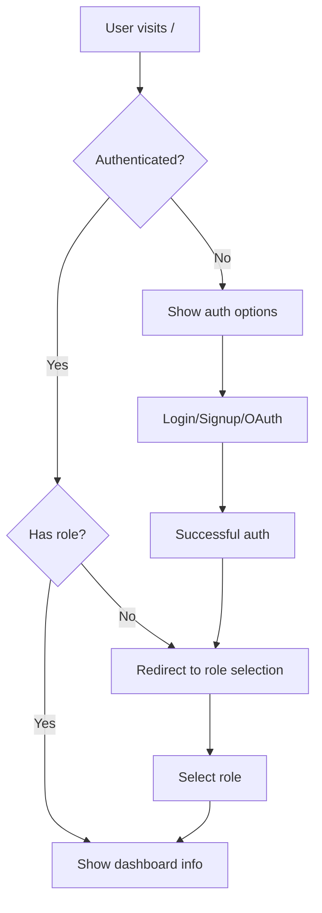

# Interview Platform API Testing Guide

## 🚀 System Overview

The Interview Platform now provides a complete API-first authentication system with:

- **Role-based authentication** (Attender/Taker)
- **OAuth integration** (Google & LinkedIn)
- **Swagger UI documentation** for easy API testing
- **Comprehensive logging** for debugging
- **Proper redirect handling** for authentication flows

## 📊 API Documentation

### Swagger UI
- **URL**: http://localhost:8000/swagger/
- **Features**: Interactive API testing, request/response examples, authentication testing

### ReDoc Documentation  
- **URL**: http://localhost:8000/redoc/
- **Features**: Clean API documentation with detailed schemas

## 🔐 Authentication Endpoints

### 1. Root API Endpoint
```
GET /
```
**Response for unauthenticated users:**
```json
{
  "message": "Welcome to Interview Platform API",
  "status": "unauthenticated",
  "auth_endpoints": {
    "login": "/accounts/login/",
    "signup": "/accounts/signup/",
    "google_oauth": "/accounts/google/login/",
    "linkedin_oauth": "/accounts/linkedin_oauth2/login/",
    "logout": "/accounts/logout/"
  },
  "documentation": {
    "swagger": "/swagger/",
    "redoc": "/redoc/"
  }
}
```

### 2. OAuth Login Endpoints
- **Google OAuth**: `/accounts/google/login/`
- **LinkedIn OAuth**: `/accounts/linkedin_oauth2/login/`
- **Regular Login**: `/accounts/login/`
- **Regular Signup**: `/accounts/signup/`

### 3. Role Selection API
```
GET /api/select-role/
POST /api/select-role/
```

**GET Response:**
```json
{
  "message": "Select or change your role",
  "current_role": null,
  "roles": {
    "attender": "Interview Attender - Can attend interviews and send requests",
    "taker": "Interview Taker - Can conduct interviews and receive requests"
  },
  "available_roles": [
    {
      "name": "attender",
      "display_name": "Interview Attender",
      "description": "Can attend interviews and send interview requests."
    },
    {
      "name": "taker", 
      "display_name": "Interview Taker",
      "description": "Can conduct interviews and receive interview requests."
    }
  ]
}
```

**POST Request:**
```json
{
  "role": "attender"
}
```

**POST Response:**
```json
{
  "message": "Role set to attender",
  "role": "attender",
  "redirect_url": "/dashboard/"
}
```

### 4. Dashboard API
```
GET /dashboard/
```

**Response:**
```json
{
  "role": "attender",
  "user": "testuser",
  "email": "test@example.com",
  "interviews": [
    {
      "id": 1,
      "sender": "testuser",
      "receiver": "interviewer",
      "status": "pending",
      "scheduled_time": "2024-01-15T10:00:00Z",
      "message": "Looking forward to the interview",
      "created_at": "2024-01-10T09:00:00Z"
    }
  ]
}
```

### 5. Profile API
```
GET /api/profile/
PUT /api/profile/
```

## 🧪 Testing the System

### 1. Run Automated Tests
```bash
# Test complete authentication flow
python test_auth_flow.py

# Test API endpoints
python test_auth_api.py

# Test OAuth endpoints
python test_oauth_endpoints.py
```

### 2. Manual Testing with Swagger UI

1. **Start the server:**
   ```bash
   python run_server.py
   ```

2. **Open Swagger UI:**
   - Navigate to: http://localhost:8000/swagger/

3. **Test Authentication Flow:**
   - Try accessing `/api/select-role/` (should return 403)
   - Login via `/accounts/login/` or OAuth
   - Access `/api/select-role/` (should work)
   - Set role via POST to `/api/select-role/`
   - Access `/dashboard/` (should work)

### 3. OAuth Testing

#### Google OAuth:
1. Visit: http://localhost:8000/accounts/google/login/
2. Complete Google OAuth flow
3. Should redirect to role selection
4. Select role and access dashboard

#### LinkedIn OAuth:
1. Visit: http://localhost:8000/accounts/linkedin_oauth2/login/
2. Complete LinkedIn OAuth flow  
3. Should redirect to role selection
4. Select role and access dashboard

## 📝 Authentication Flow



## 🔧 API Features

### ✅ Implemented Features:
- **API-first design** - All endpoints return JSON
- **Swagger UI integration** - Interactive API documentation
- **OAuth authentication** - Google & LinkedIn integration
- **Role-based access control** - Attender/Taker roles
- **Comprehensive logging** - All auth events logged
- **Error handling** - Proper HTTP status codes and error messages
- **Session management** - Secure session handling
- **Redirect loop prevention** - Prevents infinite redirects
- **Username management** - Manual signup requires username, OAuth uses real names

### 🎯 Key Endpoints Working:
- ✅ `/` - API root with auth status
- ✅ `/accounts/google/login/` - Google OAuth
- ✅ `/accounts/linkedin_oauth2/login/` - LinkedIn OAuth  
- ✅ `/accounts/login/` - Regular login
- ✅ `/accounts/signup/` - User registration
- ✅ `/api/select-role/` - Role selection
- ✅ `/api/profile/` - User profile management
- ✅ `/dashboard/` - Role-based dashboard
- ✅ `/swagger/` - API documentation
- ✅ `/redoc/` - Alternative API docs

## 🐛 Debugging

### Check Logs:
```bash
# View auth logs
tail -f logs/auth.log

# View server console output
# (Check terminal where server is running)
```

### Common Issues:
1. **OAuth not working**: Check `.env` file for correct client IDs/secrets
2. **Role selection fails**: Ensure user is authenticated first
3. **Dashboard access denied**: User must have a role assigned
4. **Redirect loops**: Check middleware logs for redirect count

## 🎉 Success Criteria

All tests should pass:
- ✅ Root endpoint returns proper JSON responses
- ✅ OAuth endpoints redirect to providers correctly
- ✅ Role selection works for authenticated users
- ✅ Dashboard accessible after role assignment
- ✅ Swagger UI provides interactive API testing
- ✅ Proper error handling for unauthenticated requests
- ✅ Logging captures all authentication events

The system now provides a complete API-first authentication platform with comprehensive documentation and testing capabilities!